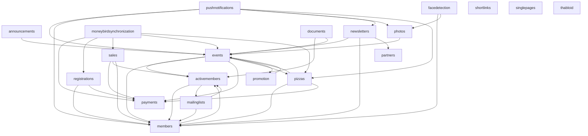

# Thalia Website

[](https://github.com/svthalia/concrexit/actions)
[](https://thalia-coverage.s3.amazonaws.com/master/index.html)
[](https://thalia-documentation.s3.amazonaws.com/master/index.html)
[](https://github.com/psf/black)
[](https://codeclimate.com/github/svthalia/concrexit)

The latest Thalia Website built on Django.

## Getting started

0. Get at least Python 3.11 and install [poetry](https://python-poetry.org/docs/#installation) and the [Pillow dependencies](#pillow-dependencies) as per below.
1. Clone this repository
2. `make member` to create the first member while in the cloned folder. This will also install all dependencies (in a separate virtual environment)
3. `make fixtures` to generate a bunch of test data
4. `make run` to run a testing server. Now you are able to visit your local concrexit at http://127.0.0.1:8000
5. Open the code in your favorite Python IDE (we have some helpful default settings provided for VSCode).

Optional, but recommended: follow the tutorial! It can be found by going to the Wiki (top of the GitHub page) and then clicking on "Your first contribution" or by clicking [here](https://github.com/svthalia/concrexit/wiki/your-first-contribution).


### Useful git commands

- `git push` to push your branch to github
- `git switch -c <branch name>` to create a branch to work on
- `git fetch origin` to synchronize your local repository with the central repository's main branch
- `git switch <branch name>` to switch between branches (branch name `master` is the main branch)
- `git add .` to add all your changes to a commit (mind to run `make fmt` in your terminal before adding changes)
- `git commit (-m <commit message>)` to commit your added changes possibly with a message
- `git rebase origin/master` to get your branch up to date with all merges
- `git status` to check the current status of your branch


### Pillow dependencies

Pillow dependencies are used for the thumbnail generation. The website will give lots of errors and work weirdly if you don't install these native dependencies.

For Ubuntu, use:

```bash
apt-get install python3-dev build-essential libjpeg-dev zlib1g-dev libwebp-dev
```

For other operating systems, see the [Pillow Documentation](https://pillow.readthedocs.io/en/latest/installation.html).

On macOS you will also need to install `libmagic`, using the brew package manager by running `brew install libmagic`.


> **Contributing**:
> also see the [contributing guidelines](CONTRIBUTING.md) for more information on how to contribute to concrexit.

## Structure

The project is split into multiple apps, each with their own purpose.
Those apps have generally the same structure, which is explained below.

- `README.md`: general information about the app. This is where you should explain what the app does and how it works on a high level.
- `models.py`: contains the database models for the app. This is the core of the app, as it defines the data that is stored in the database.
  - `migrations/`: contains the database migrations for the app
- `admin.py`: contains the admin configuration for the app. This is where the admin interface is configured.
- `urls.py`: contains the URLs for the app. If an app exposes an endpoint for users (non-admin), it should be defined here. From here, the views are imported and called. the `thaliawebsite` app contains the main `urls.py` file, which imports all the URLs from the apps.
- `views.py`: contains the views for the app. This contains the logic for the app that interacts with the models. From here, the templates are rendered and the data is passed to the templates.
- `services.py`: for any logic that doesn't properly fit in the views, you can define services. These services should be placed here. Services are procedures (business logic) that we want to trigger from multiple places (views, signals, management commands, admin ...).
- `forms.py`: contains the forms for the app. For all user input, a form should be used.
- `templates/`: contains the HTML templates for the app. Inside this container, admin forms are placed in `templates/admin/` and the rest of the templates are placed in `templates/<appname>/`. Email templates are placed in `templates/emails/` or `templates/<appname>/emails/`.
- `static/`: contains the static files for the app. Inside this container, admin static files are placed in `static/admin/` and the rest of the static files are placed in `static/<appname>/`. Then, for every type of static file, there is a separate folder. For example, CSS files are placed in `static/<appname>/css/` and JavaScript files are placed in `static/<appname>/js/`.
- `admin_views.py`: is used if an app has very special, non-default, admin views that would make the `admin.py` file too big.
- `tests.py`: contains the tests for the app. This is where the tests are defined.
- `emails.py`: used for sending emails. This is where the emails are defined. Make sure to use the `send_email` function from the utils app to send emails.
- `tasks.py`: contains [Celery](https://docs.celeryq.dev/en/stable/getting-started/index.html) tasks for the app. Celery tasks are functions that can be run in the background, without blocking the request-response cycle. This is useful for periodic tasks, and anything that's somewhat slow, such as sending emails.
- `apps.py`: contains the app configuration for the app. This is where the app is named and the app is configured. Any interaction with other apps should be done here (like defining the site's menu). Generally, you don't have to touch this file.
- `decorators.py`: if you define decorators for the app, they should be placed here.
- `exceptions.py`: if you define specific exceptions for the app, they should be placed here.
- `signals.py`: if you define signal receivers for the app, they should be placed here. Make sure to import the signals in the `apps.py` file to make sure they are registered.
- `sitemaps.py`: if you define a sitemap for the app, it should be placed here. Currently, we simply import sitemaps in the `thaliawebsite` app, but in the future, we want to register them in the `apps.py` file like we do with the menu bar items too.
- `management/commands/`: if you define management commands for the app, they should be placed here. The management commands are run using `python manage.py <command>`, which will run `management/commands/<command>.py`. Keep the code in the `management/commands/<command>.py` file as small as possible and move the logic to a service if possible.
- `api/<version>/`: if you define an API for the app, it should be placed here.
  - `api/<version>/serializers.py`: contains the serializers for the API. This is where the data is converted to JSON.
  - `api/<version>/views.py`: contains the views for the API. This is where the API endpoints are defined. From here, the serializers are imported and called.
  - `api/<version>/urls.py`: contains the URLs for the API. This is where the API endpoints are defined. From here, the views are imported and called. The `api/<version>/urls.py` file is imported in the `thaliawebsite` app's `api` module, which contains the main `urls.py` file.

Whenever the contents of a single `.py` file would become too large, we split it up into a module. For example, if the admin configuration for an app would become too large, we create an `admin` module with multiple files in it. Don't forget the `__init__.py` file in the `admin` module, otherwise it won't be recognized as a module, and make sure to import the files from the `__init__.py` file.

Note that you are not restricted to the filenames above and you can create new files if you think it is necessary. However, make sure to keep the structure consistent.

#### Data minimization
Apps that contain personal data should implement a `execute_data_minimization` method to perform data minimization on the data in the app.
This method should be called from the `execute_data_minimization` method in the `thaliawebsite` app.
In the future we should register this method in the `apps.py` file of the app, but for now we do it in the `thaliawebsite` app.

### API

#### Versions
We currently have 2 versions of the API.
The first version is the `v1` API, which is the old API.
The second version is the `v2` API, which is the new API that is actively being developed.
The `v1` API is deprecated and will be removed in the future.

#### Swagger documentation
The API has automatic documentation using Swager / OpenAPI.
This documentation is available at `/api/docs/`.

#### Authentication
`v1` uses token authentication. `v2` uses OAuth2 authentication, which is the new standard for authentication.
The OAuth2 authentication is implemented using the `django-oauth-toolkit` package.

#### Throttling
The API has throttling enabled.

#### Other (internal) APIs
Apart from the main versions (`v1` and `v2`), we also have a few specific mini-APIs that are used for specific purposes and are not really open to the public.
These are the `calendarjs` and `facedetection` APIs. The `calendarjs` API is only used by the calendar on the website (to query events) and the `facedetection` API is used by the face detection service to post face encodings.


## About concrexit

> About the name **concrexit**:
>
> _In July of 2015 we moved from the archaic Thalia-system to a Concrete5-based website where a lot of work had been put into.
> However, roughly one year later we were discussing our reluctance to maintaining the system that we had build.
> We had developed an aversion against Concrete5, its community and the horrible documentation (never mention it's maintainer, Andrew Embler).
> The CMS was never meant to do the job we wanted it to do.
> Thus we initiated Project #concrexit (Brexit was in the news at that time, update fall 2019: 4 years later it still is) to make things easy and fun again.
> The name eventually stuck.

### Scope
The purpose of this website is to provide a dedicated platform for the members of Thalia.
All functionality should be aimed at this goal.
This involves things like events and membership registration, event registration, photo albums, ordering food, etc.
As a consequence, the website also implements the member administration or a payment system, as this is a core part of the association and is needed for the aforementioned functionality.

Concrexit, however, is not a CMS (content management system) and should not be used as such.
Static pages are implemented because they should be integrated, but they cannot be edited through the admin interface (though this would not be hard to implement with [django-cms](https://www.django-cms.org/en/)), because this is not the purpose of concrexit.
Also, concrexit should not be used as a platform for implementing internal tools for specific (groups of) members.
For example:
- concrexit should not be a repository for the Thabloid
- concrexit should not implement any bookkeeping tools
- concrexit should not implement any CRM functionality
- concrexit should not implement any internal communication tools

Such tools should be implemented as separate applications, which can be integrated with concrexit if needed via the API (for example, like Thadmin).
This distinction is important, because it helps to keep the codebase maintainable and prevents feature creep (which is a big problem for concrexit).
Concrexit is an important system for the association, and it should be kept as simple as possible to ensure that it can be maintained in the future.
We should not try to implement everything in concrexit, but instead focus on the core functionality, and use other tools for the rest.

#### Apps and dependencies
We try to keep concrexit modular to improve maintainability for the future.
So in case certain apps become unmaintainable, they can be worst-case be turned off without breaking any of the other functionality.
Also, modular apps are easier to test, easier to understand and generally make the codebase more maintainable.
It's just good practice.

The graph below shows the current dependencies between the apps in concrexit.

> Note: this graph is not automatically generated! It is manually maintained and might be out of date.

> This graph leaves out the `thaliawebsite` and `utils` app as they are special apps with a lot of cross dependencies.



It is important to note that the dependencies between apps should be kept to a minimum and should be one-way.
For example, the `members` app should not depend on the `activemembers` app, but the other way around is fine.
Underlying apps should be the most robust and stable (for example, the basic functionality of the `members` app has not changed for years).

### External systems
Concrexit runs standalone, but it does integrate with a number of external systems.

- There is integration with [Moneybird](https://www.moneybird.nl/) for bookkeeping. This is implemented in the `moneybirdsynchronization` app. Note that concrexit only pushes data to Moneybird, it does not read any data from Moneybird.
- Concrexit pushes to [Google Workspace](https://workspace.google.com/) (specifically, groups). This is implemented in the `mailinglists` app. Note that we only push the groups, any other settings are not managed by concrexit and should be managed in Google Workspace directly. Neither are changes to the groups in Google Workspace pushed back to concrexit.
- There is a tight integration with [Thadmin](https://github.com/svthalia/thadmin), a user-friendly Point of Sale system for Thalia that implements Thalia Pay. This is implemented in the `sales` app.
- Face detection makes use of an AWS Lambda function, which is implemented in the `facedetection` app and [concrexit-facedetection-lambda](https://github.com/svthalia/concrexit-facedetection-lambda).
- Of course, the ThaliApp is also an external system that integrates with concrexit. Specifically, the `pushnotifications` app implements unique functionality for the ThaliApp.

In the future, we might want to integrate with other systems, such as:

- Mailchimp for sending newsletters (instead of using the `newsletters` app, which is hard to maintain and not very user-friendly)
- A more advanced integration with Moneybird
- A more advanced integration with Google Workspace
