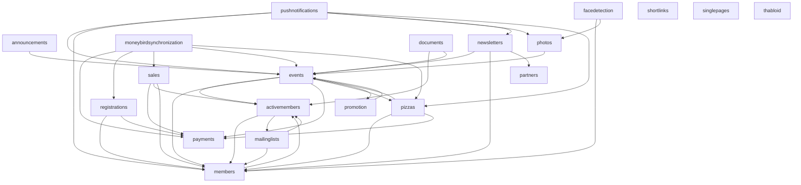

# Thalia Website

[](https://github.com/svthalia/concrexit/actions)
[](https://thalia-coverage.s3.amazonaws.com/master/index.html)
[](https://thalia-documentation.s3.amazonaws.com/master/index.html)
[](https://github.com/psf/black)
[](https://codeclimate.com/github/svthalia/concrexit)

The latest Thalia Website built on Django.


## Getting started

0. Get at least Python 3.9 and install [poetry](https://python-poetry.org/docs/#installation), the Pillow requirements and Thabloid dependencies as per below.
1. Clone this repository
2. `make member` to create the first member while in the cloned folder. This will also install all dependencies (in a separate virtual environment)
3. `make fixtures` to generate a bunch of test data
4. `make run` to run a testing server. Now you are able to visit your local concrexit at http://127.0.0.1:8000
5. Open the code in your favorite Python IDE (VSCode or Pycharm both work great)

Optional, but recommended: follow the tutorial! It can be found by going to the Wiki (top of the GitHub page) and then clicking on "Your first contribution" or by clicking [here](https://github.com/svthalia/concrexit/wiki/your-first-contribution).

### Native dependencies
Pillow dependencies are used for the thumbnail generation. The website will give lots of errors and work weirdly if you don't install these native dependencies.

For Ubuntu, use:

```bash
apt-get install python3-dev gettext gcc build-essential libtiff5-dev libjpeg-turbo8-dev zlib1g-dev libfreetype6-dev liblcms2-dev libwebp-dev
```

For other operating systems, see the [Pillow Documentation][pillow-install].

[pillow-install]: https://pillow.readthedocs.io/en/latest/installation.html

On macOS you will also need to install `libmagic`, using the brew package manager by running `brew install libmagic`.


> **Contributing**:
> also see the [contributing guidelines](CONTRIBUTING.md) for more information on how to contribute to concrexit.


## About concrexit

> About the name **concrexit**:
>
> _In July of 2015 we moved from the archaic Thalia-system to a Concrete5-based website where a lot of work had been put into.
> However, roughly one year later we were discussing our reluctance to maintaining the system that we had build.
> We had developed an aversion against Concrete5, its community and the horrible documentation (never mention it's maintainer, Andrew Embler).
> The CMS was never meant to do the job we wanted it to do.
> Thus we initiated Project #concrexit (Brexit was in the news at that time, update fall 2019: 4 years later it still is) to make things easy and fun again.
> The name eventually stuck._

### Scope
The purpose of this website is to provide a dedicated platform for the members of Thalia.
All functionality should be aimed at this goal.
This involves things like events and membership registration, event registration, photo albums, ordering food, etc.
As a consequence, the website also implements the member administration or a payment system, as this is a core part of the association and is needed for the aforementioned functionality.

Concrexit, however, is not a CMS (content management system) and should not be used as such.
Static pages are implemented because they should be integrated, but they cannot be edited through the admin interface (though this would not be hard to implement with [django-cms](https://www.django-cms.org/en/)), because this is not the purpose of concrexit.
Also, concrexit should not be used as a platform for implementing internal tools for specific (groups of) members.
For example:
- concrexit should not be a repository for the Thabloid
- concrexit should not implement any bookkeeping tools
- concrexit should not implement any CRM functionality
- concrexit should not implement any internal communication tools

Such tools should be implemented as separate applications, which can be integrated with concrexit if needed via the API (for example, like Thadmin).
This distinction is important, because it helps to keep the codebase maintainable and prevents feature creep (which is a big problem for concrexit).
Concrexit is an important system for the association, and it should be kept as simple as possible to ensure that it can be maintained in the future.
We should not try to implement everything in concrexit, but instead focus on the core functionality, and use other tools for the rest.

#### Apps and dependencies
We try to keep concrexit modular to improve maintainability for the future.
So in case certain apps become unmaintainable, they can be worst-case be turned off without breaking any of the other functionality.
Also, modular apps are easier to test, easier to understand and generally make the codebase more maintainable.
It's just good practice.

The graph below shows the current dependencies between the apps in concrexit.

> Note: this graph is not automatically generated! It is manually maintained and might be out of date.

> This graph leaves out the `thaliawebsite` and `utils` app as they are special apps with a lot of cross dependencies.



It is important to note that the dependencies between apps should be kept to a minimum and should be one-way.
For example, the `members` app should not depend on the `activemembers` app, but the other way around is fine.
Underlying apps should be the most robust and stable (for example, the basic functionality of the `members` app has not changed for years).

### External systems
Concrexit runs standalone, but it does integrate with a number of external systems.

- There is integration with [Moneybird](https://www.moneybird.nl/) for bookkeeping. This is implemented in the `moneybirdsynchronization` app. Note that concrexit only pushes data to Moneybird, it does not read any data from Moneybird.
- Concrexit pushes to [Google Workspace](https://workspace.google.com/) (specifically, groups). This is implemented in the `mailinglists` app. Note that we only push the groups, any other settings are not managed by concrexit and should be managed in Google Workspace directly. Neither are changes to the groups in Google Workspace pushed back to concrexit.
- There is a tight integration with [Thadmin](https://github.com/svthalia/thadmin), a user-friendly Point of Sale system for Thalia that implements Thalia Pay. This is implemented in the `sales` app.
- Face detection makes use of an AWS Lambda function, which is implemented in the `facedetection` app and [concrexit-facedetection-lambda](https://github.com/svthalia/concrexit-facedetection-lambda).
- Of course, the ThaliApp is also an external system that integrates with concrexit. Specifically, the `pushnotifications` app implements unique functionality for the ThaliApp.

In the future, we might want to integrate with other systems, such as:

- Mailchimp for sending newsletters (instead of using the `newsletters` app, which is hard to maintain and not very user-friendly)
- A more advanced integration with Moneybird
- A more advanced integration with Google Workspace
