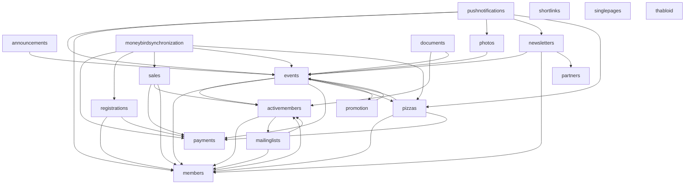

# Thalia Website

[](https://github.com/svthalia/concrexit/actions)
[](https://thalia-coverage.s3.amazonaws.com/master/index.html)
[](https://thalia-documentation.s3.amazonaws.com/master/index.html)
[](https://github.com/psf/black)
[](https://codeclimate.com/github/svthalia/concrexit)

The latest Thalia Website built on Django.

## Getting started

0. Get at least Python 3.9 and install [poetry](https://python-poetry.org/docs/#installation), the Pillow requirements and Thabloid dependencies as per below.
1. Clone this repository
2. `make member` to create the first member while in the cloned folder. This will also install all dependencies (in a separate virtual environment)
3. `make fixtures` to generate a bunch of test data
4. `make run` to run a testing server. Now you are able to visit your local concrexit at http://127.0.0.1:8000
5. Open the code in your favorite Python IDE (VSCode or Pycharm both work great)

Optional, but recommended: follow the tutorial! It can be found by going to the Wiki (top of the GitHub page) and then clicking on "Your first contribution" or by clicking [here](https://github.com/svthalia/concrexit/wiki/your-first-contribution).
## Useful git commands

- `git push` to push your branch to github
- `git checkout -b <branch name>` to create a branch to work on
- `git fetch origin` to synchronize your local repository with the central repository's main branch
- `git switch <branch name>` to switch between branches
- `git add .` to add all your changes to a commit (mind to run `make fmt` in your terminal before adding changes)
- `git commit (-m <commit message>)` to commit your added changes possibly with a message
- `git rebase origin/master` to get your branch up to date with all merges
- `git status` to check the current status of your branch
## When working on an issue

- Make sure you are not working on the main branch but on a separate branch.
- Assign the issue to yourself on GitHub.
- Make sure not just to read the issue but also the conversation below the issue.

## Native dependencies

Pillow dependencies are used for the thumbnail generation. The website will give lots of errors and work weirdly if you don't install these native dependencies.

### Pillow dependencies

For Ubuntu, use:

```bash
apt-get install python3-dev gettext gcc build-essential libtiff5-dev libjpeg-turbo8-dev zlib1g-dev libfreetype6-dev liblcms2-dev libwebp-dev
```

For other operating systems, see the [Pillow Documentation][pillow-install].


[pillow-install]: https://pillow.readthedocs.io/en/latest/installation.html


On macOS you will also need to install `libmagic`, using the brew package manager by running `brew install libmagic`.


## Apps and dependencies
We try to keep concrexit modular to improve maintainability for the future. This is roughly how the current apps depend on each other. It is important to keep this graph as simple as possible, especially when considering the building of new features.

This graph leaves out the `thaliawebsite` and `utils` app as they are special apps with a lot of cross dependencies.




## Language

Make sure to use British English.

## Testing and linting

If you're just starting to work on the website, this isn't very relevant. Linting and formatting is automaticallly done by the pre-commit hook which is installed from the `make` command stuff. If you want to know what linting we use, read on:

All code has to be run through [isort](https://github.com/PyCQA/isort) and [`black`](https://github.com/psf/black) before being committed. To isort and black the code before committing run `make fmt` one the base directory of this project. We also use [pre-commit](https://pre-commit.com) to make sure you don't forget about this. Pre-commit is automatically installed by `make`.
If you want to integrate `black` with your editor look in the [`black` docs](https://black.readthedocs.io/en/stable/editor_integration.html). On linux you can find the black executable in `~/.cache/poety/virtualenvs/<your env>/bin/black`.

You can run all the tests with `make test`, afterwards you can check the coverage with `make coverage`.

## For admins

It's possible for admins to push to the `master` branch, but this must only be
done with care. As such, a pre-push git hook is available which asks for confirmation
whenever a push to `master` is done. All admins should have this hook installed!

To install the git hook:
```bash
mv scripts/pre-push-hook ./git/hooks/pre-push
```
