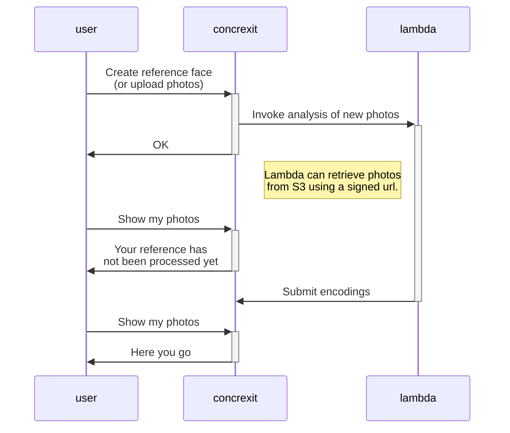

# Face detection

`facedetection` is an app that expands upon the `photos` app by providing face recognition.
Members can upload reference faces and get an overview of photos on which they appear.

Face recognition works by extracting 'encodings' from faces in photos. An encoding is a vector of 128 floats, that represent a face, and can be compared by their euclidean distance. We use the [`face_recognition`](https://face-recognition.readthedocs.io/en/latest/readme.html) library to extract these encodings.

Since extracting encodings is quite resource-intensive, and `face_recognition` is a rather large dependency, it would be very unpractical to do extraction on the main concrexit server. Instead, we use an AWS Lambda function, triggered by concrexit, which returns face encodings after some time by writing to concrexit's API. This way, concrexit does not do any heavy work, and we can scale face recognition very well. Lambda will run many function calls in parallel, and we pay only when used, so we should be able to process hundreds of new photos in seconds, without having to pay for a server that is idle most of the time.

The Lambda function that does this is at [svthalia/concrexit-facedetection-lambda](https://github.com/svthalia/concrexit-facedetection-lambda).

An example of the process can be visualized as follows:

If no Lambda is configured (such as in local development), processing will simply not happen, without causing any problems. If at some point, a Lambda is set up, all photos that had not been processed yet will still be submitted when calling the `trigger_facedetection_lambda` management command.
